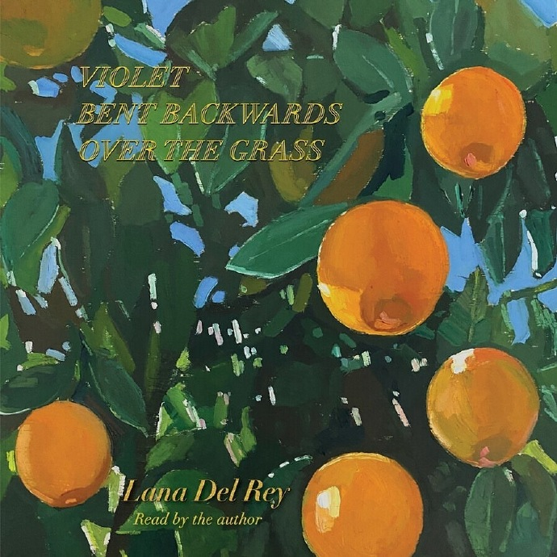
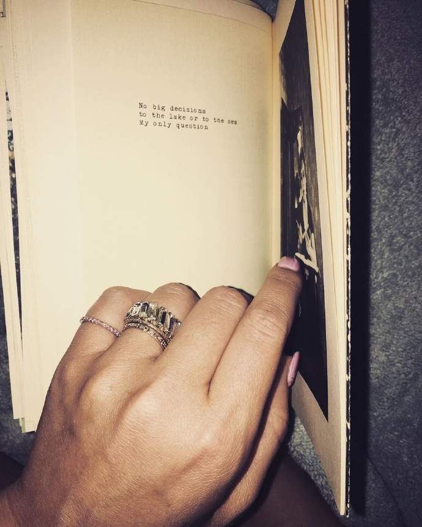

 Violet Bent Backwards Over The Grass

 Lana Del Rey

----

 "Lana Del Rey’s first poetry collection proves that she’s the Ginsberg of the Instapoetry generation."

----

 "Well, it’s a vulnerable thing in some ways to write a book of any sort. So it is truly meant to be found by those who just come upon it…  And I think that’s the whole point for any fans of mine to remember that when you do things for fun and for yourself, it just might end up being one of the best things that you’ve ever done regardless of people’s opinions of them.  Sometimes the most important thing to ask yourself is: What would I do if I was willing to be completely embarrassed? And by doing that, I often find I am taking my next right action.."

----

 
LA i’m a dreamer but i’m from nowhere who am i to dream 
LA i’m upset i have complaints listen to me 
they say i came from money and i didn’t 
and i didn’t even have love and it‘s unfair

